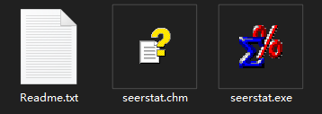
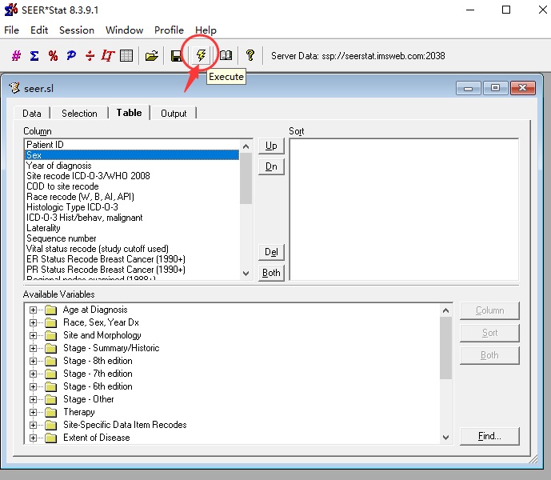

## ⭐SurvTRACE: Transformers for Survival Analysis with Competing Events

This repo provides the implementation of **SurvTRACE** for survival analysis. It is easy to use with only the following codes:

```python
from survtrace.dataset import load_data
from survtrace.model import SurvTraceSingle
from survtrace import Evaluator
from survtrace import Trainer
from survtrace import STConfig

# use METABRIC dataset
STConfig['data'] = 'metabric'
df, df_train, df_y_train, df_test, df_y_test, df_val, df_y_val = load_data(STConfig)

# initialize model
model = SurvTraceSingle(STConfig)

# execute training
trainer = Trainer(model)
trainer.fit((df_train, df_y_train), (df_val, df_y_val))

# evaluating
evaluator = Evaluator(df, df_train.index)
evaluator.eval(model, (df_test, df_y_test))

print("done!")
```


### 🔥See the demo

Please refer to **experiment_metabric.ipynb** and **experiment_support.ipynb** !


### 🔥How to config the environment

Use our pre-saved conda environment!

```shell
conda env create --name survtrace --file=survtrace.yml
conda activate survtrace
```

or try to install from the requirement.txt

```shell
pip3 install -r requirements.txt
```


### 🔥How to get SEER data

1. Go to https://seer.cancer.gov/data/ to ask for data request from SEER following the guide there.

2. After complete the step one, we should have the following **seerstat software** for data access. Open it and sign in with the username and password sent by seer.

  

3. Use seerstat to open the **./data/seer.sl** file, we shall see the following.

    

Click on the 'excute' icon to request from the seer database. We will obtain a csv file.

4. move the csv file to **./data/seer_raw.csv**, then run the python script **process_seer.py**, as

   ```shell
   python process_seer.py
   ```

   we will obtain the processed seer data named **seer_processed.csv**.


### 📝Functions

- [x] single event survival analysis
- [x] competing events survival analysis
- [ ] multi-task learning
- [ ] automatic hyperparameter grid-search


### :smile:If you find this result interesting, please consider to cite this paper:

```latex
@article{wang2021survtrace,
      title={Surv{TRACE}: Transformers for Survival Analysis with Competing Events}, 
      author={Zifeng Wang and Jimeng Sun},
      year={2021},
      eprint={2110.00855},
      archivePrefix={arXiv},
      primaryClass={cs.LG}
}
```
